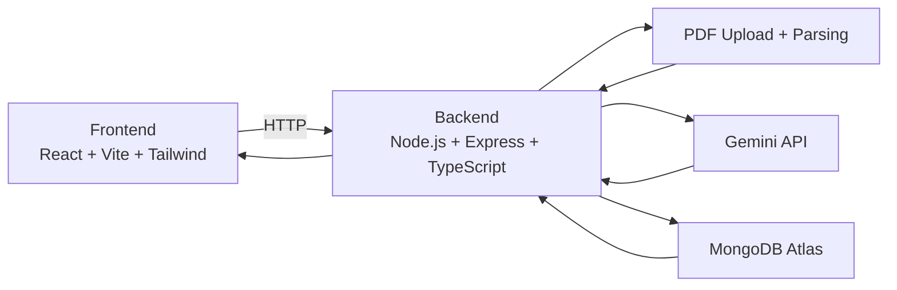

# StudyMate AI Architecture

**Flow**

1. User uploads PDF in frontend.
2. Backend parses PDF text.
3. Text is sent to Gemini for summary/quiz.
4. Results are saved in MongoDB (user-scoped).
5. Frontend displays summary, quiz, flashcards, planner, and history.
